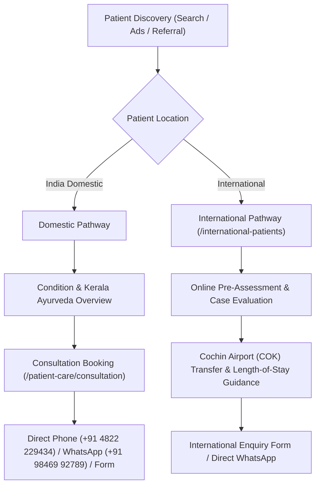

# Stage 13 — Conversion Hardening & Patient Journey Report
**Omshree Sidha Hospital**

---

## 1. Dual-Track Patient Acquisition Strategy

---

## 2. Page-by-Page Intent & Conversion Hardening

| Page Path | Target Audience | Primary CTA | Secondary CTA | Conversion Optimization Applied |
|---|---|---|---|---|
| `/` | General Patients & Families | `Book a Consultation` | `WhatsApp Us` | Streamlined concern grid directly to condition hubs |
| `/international-patients` | Global Diaspora & Overseas Patients | `International Patient Enquiry` | `WhatsApp Medical Team` | Highlighted COK airport transfers, no visa guarantee promises |
| `/conditions/cardiovascular` | Cardiac & Low EF Patients | `Book Cardiac Consultation` | `WhatsApp Us` | Non-invasive supportive care positioning with clinical disclaimers |
| `/conditions/liver` | Fatty Liver & Cirrhosis Patients | `Book Liver Health Consultation` | `Call Reception` | Focus on dosha metabolism and hepatic rejuvenation |
| `/conditions/gastrointestinal` | Chronic IBS, Crohn's & Piles | `Consult Digestive Specialists` | `WhatsApp Us` | Agni (digestive fire) balance and classical Panchakarma care |
| `/treatments/therapies` | Inpatient Care Inquirers | `Read Therapy Details` | `Book Consultation` | Clarified that individual therapies are tools, not standalone cures |
| `/contact` | High-Intent Enquirers | `Submit Consultation Enquiry` | `Call: +91 4822 229434` | Full state machine, double-click lock, anti-spam, and lead ID generation |
